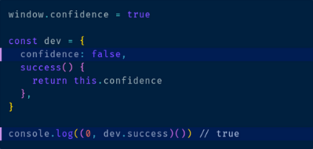
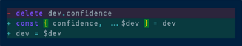

# parcel-plugin-marked-prismjs

Parcel plugin for easily integrating with prismjs plugins by custom marked renderer, feel free to fork this repository and make your own renderer for prismjs.

## Installation

```
npm i parcel-plugin-marked-prismjs -D
```

## Features

### 0. match braces

support vscode extension `Bracket Pair Colorizer 2` like rainbow highlight

### 1. heading anchors

input:

```md
## Subtitle With Anchor
```

output:

```html
<h2>
  <a
    name="subtitle-with-anchor"
    class="anchor"
    href="#subtitle-with-anchor"
  ></a>
  Subtitle With Anchor
</h2>
```

### 2. line highlight

use `{}` for supporting code editor syntax highlight

input:

````md
```js{4,10}
window.confidence = true

const dev = {
  confidence: false,
  success() {
    return this.confidence
  },
}

console.log((0, dev.success)()) // true
```
````

output:



### 3. diff

input:

````md
```diff-js
- delete dev.confidence
+ const { confidence, ...$dev } = dev
+ dev = $dev
```
````

output:



Besides, codespan ought to be styled by class `codespan`.

## Tests coverage

```c
--------------|---------|----------|---------|---------|-------------------
File          | % Stmts | % Branch | % Funcs | % Lines | Uncovered Line #s
--------------|---------|----------|---------|---------|-------------------
All files     |   95.24 |       75 |   85.71 |      95 |
 __test__     |     100 |      100 |     100 |     100 |
  index.js    |     100 |      100 |     100 |     100 |
 src          |   94.12 |       75 |   85.71 |   93.75 |
  helper.js   |    87.5 |       50 |   66.67 |   85.71 | 13
  renderer.js |     100 |    83.33 |     100 |     100 | 14
--------------|---------|----------|---------|---------|-------------------
Test Suites: 1 passed, 1 total
Tests:       4 passed, 4 total
Snapshots:   0 total
Time:        0.892 s, estimated 1 s
```
