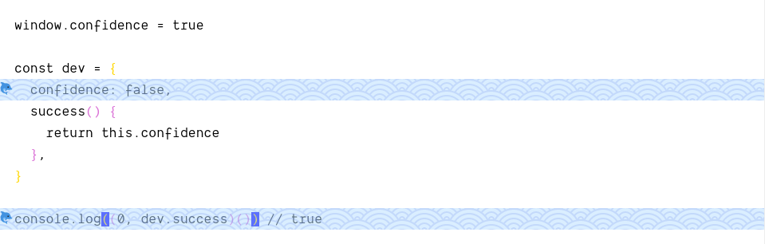

# parcel-plugin-marked-prismjs [](https://travis-ci.com/hemmingson/parcel-plugin-marked-prismjs) [](https://codecov.io/gh/hemmingson/parcel-plugin-marked-prismjs)

Parcel plugin for easily integrating with prismjs plugins by custom marked renderer, feel free to fork this repository and make your own renderer for prismjs.



## Installation

```bash
npm i -D parcel-plugin-marked-prismjs

# via yarn
yarn add -D parcel-plugin-marked-prismjs
```

## Features

### 0. match braces

Support vscode extension `Bracket Pair Colorizer` like rainbow highlight.

### 1. heading anchors

```md
## Subtitle With Anchor
```

will transpile to:

```html
<h2>
  <a
    name="subtitle-with-anchor"
    class="anchor"
    href="#subtitle-with-anchor"
  ></a>
  Subtitle With Anchor
</h2>
```

### 2. line highlight

Use `{}` for supporting code editor syntax highlight.

````md
```js{4,10}
window.confidence = true

const dev = {
  confidence: false,
  success() {
    return this.confidence
  },
}

console.log((0, dev.success)()) // true
```
````

### 3. diff highlight

````md
```diff-js
- delete dev.confidence
+ const { confidence, ...$dev } = dev
+ dev = $dev
```
````

Besides, codespan ought to be styled by class `.codespan`.
